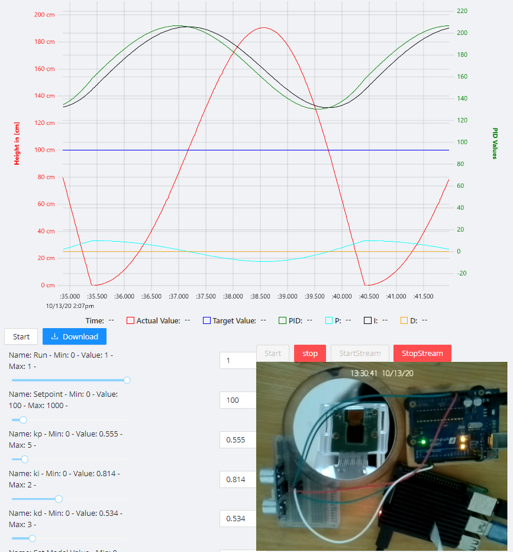

# Overview Pirate Flag

Under this Banner the client is placed. The client is a React application. Its job is to display the provided data from the hook and to enable remote control. Additionally a live feed can be displayed.

[Getting Started](10-flag-getting-started.md){: .md-button .md-button--primary }

Here you can see a first implementation of a Pirate-Flag client.

## Requirements

The rough requirements of the Client are:

* The client needs to display a chart of the data sent by the hook.
* The client needs to be able to return control commands and change variables on the Arduino
* A live feed needs to be displayed of the project.

[Requirements](20-flag-requirements.md){: .md-button  }

## Implementation

The React app is based on a CRA template with Typescript enabled. 

Separate components were created for the chart, the controls and the live feed.

[Further details on Implementation](30-flag-implementation.md){: .md-button}

## Validation and Future Steps

[Validation](40-flag-validation.md){: .md-button}

