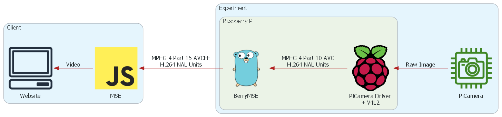

# Overview

In order to directly monitor the experiment and the setup that is remotely controlled by PirAtE and to make the measurements more engaging, a webcam solution was found.

This solution uses the existing Raspberry Pi and a [Raspberry Pi Camera Module](Theory/Camera%20and%20Driver/rpicamera.md) (or a [USB Webcam with integrated H264 encoder](Theory/Camera%20and%20Driver/h264camera.md)) to capture video and provides a endpoint to stream this data to a webpage.

[Getting Started](10-spyglass-getting-started.md){: .md-button .md-button--primary }

## Requirements

The Goals for the Camera Implementation have been:

- Works on Raspberry Pi
- Low Ressourcen Usage on server and client side
- Low Latency
- Low Bandwidth
- Viewable from Browser
- Works in Reutlingen University's network

[Requirements](20-spyglass-requirements.md){: .md-button}

## Implementation

This video implementation is based on the project [berrymse](https://github.com/thinkski/berrymse) from Chris Hiszpanski. 

!!! note "Description from the [berrymse](https://github.com/thinkski/berrymse) project"

        H.264 Network Abstraction Layer (NAL) units are read from `/dev/video0`, a
        Video4Linux2 compatible camera interface. Each unit corresponds to one frame.
        Frames are packaged into MPEG-4 ISO BMFF (ISO/IEC 14496-12) compliant
        fragments and sent via a websocket to the browser client. The client appends
        each received buffer to the media source for playback.

This camera stack has three major components, the hardware/driver stack, the server and the client.

[Further details on Implementation](30-spyglass-implementation.md){: .md-button}

## Validation

The implementation was tested in multiple hour stress tests.

Currently the Implementation runs with the following characteristics:
    - CPU utilization: sub 10%
    - Bandwidth: 1.5 Mbit/s
    - Latency: < 200ms
    - Resolution: 1280x720
    - Works with university Network
    - USB Video Class devices are not well supported
    - Safari support has not been tested

With these characteristics it matches the requirements and is suitable.

[Validation](40-spyglass-validation.md){: .md-button}

## Research and Theory

The information collected throughout the implementation has been placed into the subfolders.

### Video Streaming

In the Theory section further information about video streaming can be found.
### Licensing

Because the underlying solution is licensed under the [AGPL](https://www.gnu.org/licenses/agpl-3.0.en.html), a copy left license, these kind of licenses and their impact on this project were studied.

[Further details on licensing](Theory/licensetheory.md){: .md-button}

## Legacy Solution

The original solution was based on [gstreamer](Research/Sources/gstreamer.md) and a dockerized [Janus WebRTC Broadcaster](Research/Streamers/janus.md) to provide a [WebRTC](Research/webRTC.md) video endpoint. WebRTC proved unusable for our use case, because the Reutlingen University network was incompatible with STUN signaling. Because of this no stream could cross the network border. A possible solution would be a TURN server, but this incurs a monthly cost and was not used. See https://github.com/bartbalaz/janus-container at "Experimentation and observations" for similar problem.

Outside the network this solution performed adequately, with low latency.