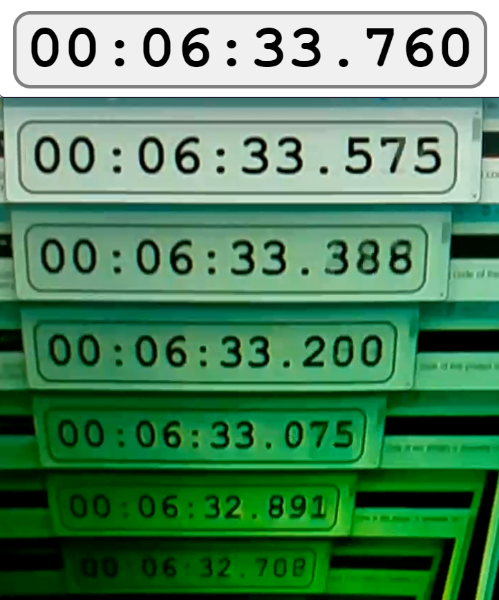

# Validation

In order to gauge the fit of this application for the requirements a set of tests were conducted.
## Tests

The

Visual tests by recursively filming a stopwatch showed a latency below 200ms.
<figure markdown>
  {width=50%, align=left}
  <figcaption>This image depicts a screenshot of a stopwatch that has been recursively captured and transmitted with this application. With a delta of 1052ms and 6 transmission periods a lag of 175ms can be determined. </figcaption>
</figure>

Stress tests with up to 7 Streams showed only minoutilization on the Raspberry Pi around 15% always below 20%. Constant negligible memory usage (0.4%)

1.5 mbits per stream on both ends (obviously)

Long term tests only stopped when the websocket connection was closed by the browser (during standby for instance) after multiple hours. The reset Button works 

The server never generated any problems or crashes.

## Future steps and Improvements

- Replace Websocket connection with Webtransport
- Replace MSE with Webcodecs
- migrate to libcamera (as soon as its ready for Raspberry Pi camera applications)
  - [picamera2 preview](https://www.raspberrypi.com/news/a-preview-release-of-the-picamera2-library/)
- Add fallback for iOS
- Add configuration for resolution and bandwith
- Add USB webcam support
- Add server reboot on crash (even though it was rock solid during testing)
- Add method to rotate 90°
  - either on Raspberry PI side or on Webpage
- No guard rails for config (1920x1080 and bitrate of 1000000 did not work)
  - to high resolution breaks video
- Only h264 
  - generate h264 stream with e.g. ffmpeg loopback from usb camera (down scalable compared to current USB camera interface which is not very customizable (bitrate is not changeable))
- automatic reconnecting