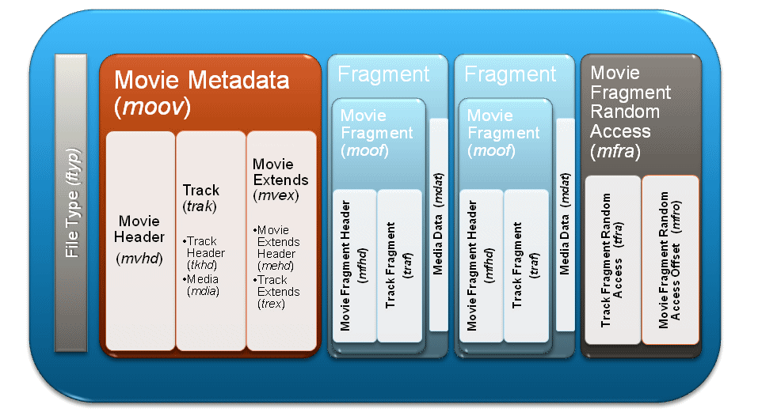

# MPEG-4 (ISO/IEC-14496)

MPEG-4 is a Standard for Coding of audio-visual objects from MPEG (The Moving Picture Experts Group).

Important for the project berryMSE are only a view Parts from this standard needed. The most important and used ones can be found in this Section.

## MPEG-4 Part 10 Advanced Video Coding (AVC) H.264 ISO/IEC 14496-10

Part 10 of MPEG-4 defines the H.264 Compression. The RPI Camera outputs data in this format in the Device Node e.g. ``/dev/video0`` channel, if Pixelformat "H264" in V4L2 driver is selected. The BerryMSE code configures the Device Node in that way that two NAL Units can be stored and retrieved.

BerryMSE uses the given H264 directly. After adding MPEG-4 Part 12 and Part 15 extensions, it sends it to the Client. The Client uses the Media Source Extensions (MSE) to display the video. The MSE can decode the H264 Video on its own, this is why Encoding and Decoding isn't needed in this Project.

More to MPEG-4 Part 10 can be found here in [H.264](h264.md).

## MPEG-4 Part 12 ISO Base Media File Format (ISOBMFF) ISO/IEC 14496-12

MPEG-4 Part 12 defines the structure for time-based files for video and audio.
The file-structure is object oriented, mean all Data is contained in blocks called boxes. Sometimes they get called Containers or Atoms. Every Box is identified by a 4 byte/char Type indicator (e.g. "ftyp") followed by its size/length in bytes (int32). The Content of the Box is depending on its type and can also be other boxes.

The file-structure supports Streaming of Media Data by allowing the splitting of media data files.

https://en.wikipedia.org/wiki/ISO/IEC_base_media_file_format
https://mpeg.chiariglione.org/standards/mpeg-4/iso-base-media-file-format

## MPEG-4 Part 14 MP4 File Format ISO/IEC 14496-14

MPEG-4 Part 14 set the standard for MP4 Files. It stores the video and audio in a File as MP4 based on the ISOBMFF File Structure (MPEG-4 Part 12).

The Video can be a H264 (MPEG Part 10), H265 (MPEG-H Part 2) or an older MPEG Compression Format.

https://mpeg.chiariglione.org/standards/mpeg-4/mp4-file-format
https://en.wikipedia.org/wiki/MPEG-4_Part_14

## MPEG-4 Part 15 Advanced Video Coding (AVC) file format ISO/IEC 14496-15

MPEG-4 Part 15 defines the storage and transport of AVC/H264 (MPEG-4 Part 10) Streams in ISOBMFF File Format (MPEG-4 Part 12). MP4 (MPEG-4 Part 14) uses a similar ISOBMFF storage format.

https://mpeg.chiariglione.org/standards/mpeg-4/carriage-nal-unit-structured-video-iso-base-media-file-format

 Fragmented Movie Architecture:

Source: https://alexzambelli.com/blog/wp-content/uploads/smooth_slide16.png

In MPEG-4 Part 15 every Frame/NAL Unit is stored in its own independent ISOBMFF sample. The Initial sample doesn't hold any Video/Audio data only Settings and Parameters for the streaming. This settings are needed to configure the Decoder.
The Decoder can than Decode the Media Data in the Fragments. Each Fragment comes with its own Information Header Box, which holds the media data length and sequence number of the segment.

Fragment Architecture:

Source: https://alexzambelli.com/blog/wp-content/uploads/smooth_slide17.png

(Fragmented Movies Similar Technologie from Microsoft based on MEPG-4 Part 12 but not Part 15
https://alexzambelli.com/blog/2009/02/10/smooth-streaming-architecture/
https://alexzambelli.com/blog/smooth-streaming-faq/)

The Typical File Structure can be seen in the File Tree Below.

Typical ISOBMFF Structure for Streaming Application.

Source: https://mpeg.chiariglione.org/standards/mpeg-4/iso-base-media-file-format
Source: https://mpeg.chiariglione.org/sites/default/files/files/standards/parts/docs/N18093_ISOFF%28TS%29.pptx

`MOOV` is the Initial Sample and holds all Information about the Video (e.g. Audio/Video Track, Codec,..). It is very Complex and contains a big amount of Boxes as it can be seen in the Picture.

The AVC FF Structure and Values used in BerryMSE is shown in [AVC File Format Example](avcff.md). 

Segments in a Streaming Application (BerryMSE).

Source: https://mpeg.chiariglione.org/standards/mpeg-4/iso-base-media-file-format
Source: https://mpeg.chiariglione.org/sites/default/files/files/standards/parts/docs/N18093_ISOFF%28TS%29.pptx

The [Media Source Extension (MSE)](mse.md) of Browsers can handle a Streams based on MPEG-4 Part 15. Each NAL Unit gets send separate and is combined in the SourceBuffer of the MSE. This would allow to send the H.264 from a Camera directly to the User, which means the host would no longer need to decode and encode the video stream.

The project [BerryMSE](https://github.com/thinkski/berrymse) and [pi_streaming](https://www.codeinsideout.com/blog/pi/stream-picamera-h264/) use this Methode of sending each NAL Unit separate as a Websocket Msg to the User. BerryMSE uses the MSE and pi_streaming uses a Javascript to decode the video.
