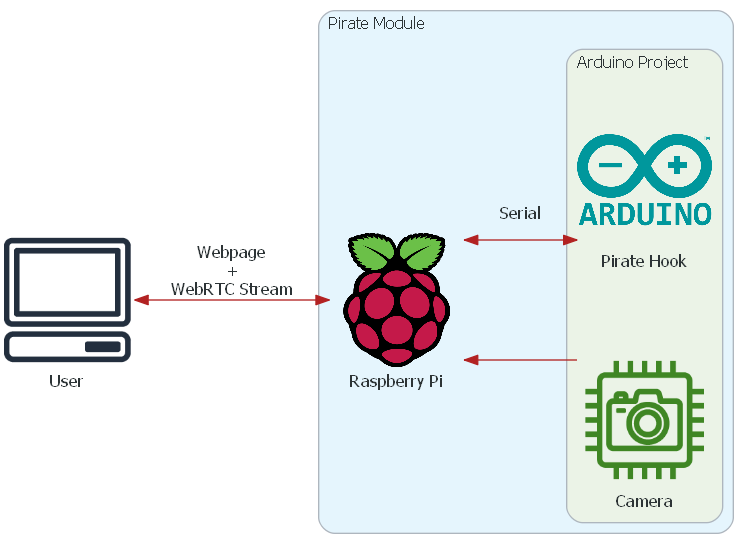
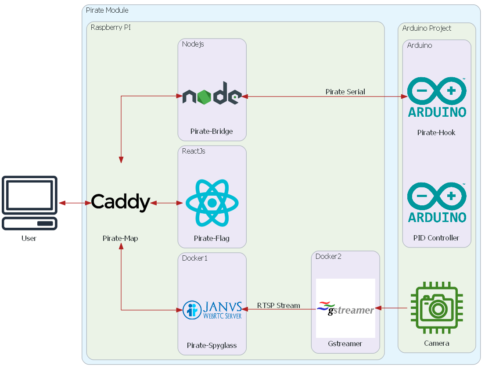

---
hide:
  - navigation
---
# Pirate

Pirate (short for "Pirate Implements Remote Access to Experiments") is a remote monitoring solution for Arduino projects.

The solution uses a Raspberry PI as an intermediate server translating and broadcasting between the Arduino project and client webpages. It also supports the use of a webcam for a live view of the project.

[Getting Started](firstrun.md){: .md-button .md-button--primary }

## Motivation

When using an Arduino there are a lot of pain points. Pirate looks to solve a few of them:

* Reading variables
    * is often done by printing them via Serial.Print to a console.
        * String handling is slow and might influence cycle time. 
        * The data scrolls by to fast to be useful.
    * If a display is used the available space is to little to be very useful.
* Changing parameters 
    * often entails changing them in the source, recompiling and flashing again.
    * Alternatively additional hardware can be used to do that manually.
* Extracting data
* Monitoring the project from a distance.

Pirate looks to be a solution to provide an realtime Interface where the variables and parameters can be monitored and changed on the fly. While doing that it also strives to have as little impact on cycle performance as possible.

[Project Goals](goals.md){: .md-button .md-button--primary }

## Overview
When integrated into an Arduino project via the [Pirate Hook](Pirate-Hook/00-hook.md) variables can be designated to be sent or received. These then get periodically transmitted via UART to the [Pirate Bridge](Pirate-Bridge/00-bridge.md) on a connected Raspberry PI. The Bridge uses the data to provide an [interface](Pirate-Bridge/client-facing-interface.md) for the clients. The standard client is called [Pirate Flag](Pirate-Flag/00-flag.md). It reads data streams from the interface and displays the data in a webpage. It can in turn send requests to the [Pirate Bridge](Pirate-Bridge/00-bridge.md) to change parameters on the Arduino. Parallel to this the Raspberry PI can also provide a live view of the project with [Pirate Spyglass](Pirate-Spyglass/Legacy%20Solution/00-spyglass_legacy.md). To help with the routing the [Pirate Map](Pirate-Map/00-map.md) is used.

!!! warning

    In Mechatronik Project 2 a new Streaming Soulution has been created and Replaces the [OLD Pirate Spyglass](Pirate-Spyglass/Legacy%20Solution/00-spyglass_legacy.md) with a new [Pirate Spyglass](Pirate-Spyglass/00-spyglass.md). The new one is now a complete Stand Alone that runs with only ONE Executable and is in its own Project.

## The Project is currently hosted on Github
The documentation can be found on: https://ch3ri0ur.github.io/piratedocs/

The source code on:
- https://github.com/Ch3ri0ur/pirate_modules
- https://github.com/Ch3ri0ur/pirate
- https://github.com/Ch3ri0ur/piratedocs
- https://github.com/Ch3ri0ur/berrymse
- https://github.com/Ch3ri0ur/go-v4l2

## Currently developed by:
- Maximilian Koch
- Christian Wappler

